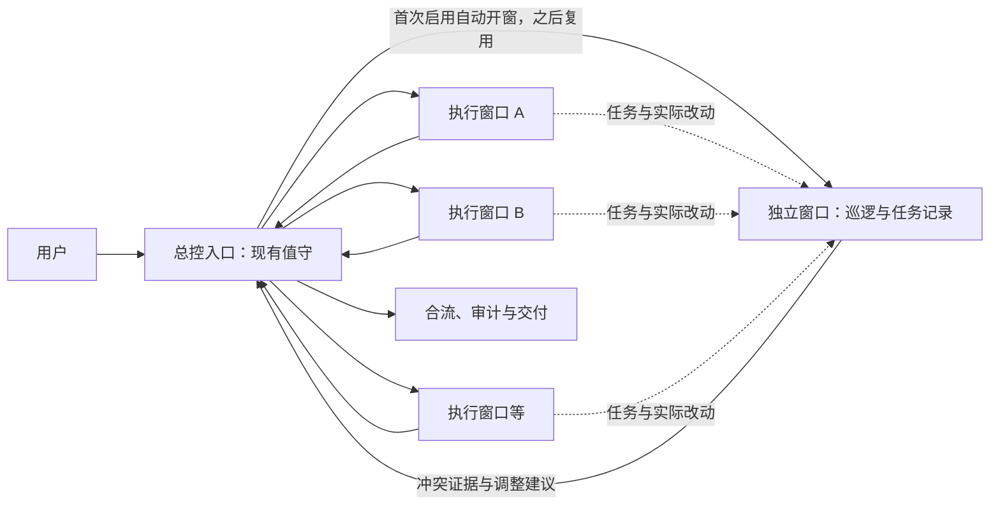

# 2026-10-01 · 巡逻、清道夫、十窗口协作与跨模型调度设计

> 职责边界：把用户多页面并行开发的冲突、反复 rebase 与验证耗时，转成可评审的协作设计；定义独立记录窗口、定期回收 worktree 的清道夫和可选跨模型接线。本文是设计草案，未改变现行合并权、回收权限、CI 或 CHARTER，也未启动巡逻、创建窗口、清理 worktree 或调用模型。
> 基线：Agent-On `v0.25.2` / main `124303d`；2026-10-01 读取现有协作规则、CLI 帮助与厂商文档。调用接口已核，认证、额度、真实执行与耗时均未测。

## 1. 本轮已明确的需求

- 保留现有值守：用户认为目前运行尚可。
- 增加巡逻：共享改动在工作展开前或过程中被发现，避免到合并时才解冲突。
- 十个窗口时有统一调和入口，用户不用自己搬运全场状态。
- 自动创建并展示独立的巡逻/记录窗口：不用用户手动新建，也不把它作为主窗口内的一次内联检查；该窗口维护简短任务清单，主窗口仍是日常沟通入口。
- 增加“清道夫”：定期自动释放没有继续使用价值的 worktree，让工作树的生命周期有明确收尾。
- 减少重复验证与为页面小改动套完整 TDD 的成本，保留有效验证。
- 单独增加 Agent OS 调度能力：例如从 Claude Code 派任务给 Codex 或 Grok。

具体角色权限、默认测试策略、接线实现仍是下文建议，不能把功能意图当成修改既有权限政策的批准。

## 2. 角色与用户入口

**一个总控入口、一个自动打开的独立巡逻/记录窗口、若干执行者；值守继续负责合流。** 总控可以由已有值守窗口兼任。按用户后续明确的需求，巡逻默认以独立会话运行并展示，拥有自己的上下文、会话标识和运行状态；原先“主会话内的子助手或按需检查”不再作为默认产品形态。用户继续在主窗口表达需求，记录窗口自动接收相关事件并汇总，不要求用户在两处重复输入。

清道夫是同一协作系统的后台回收职责，默认由定时/事件作业执行，状态显示在独立巡逻窗口里，不要求用户再管理一个常驻聊天窗口。

| 职责 | 做什么 | 如何避免彼此打架 |
|---|---|---|
| 总控入口（值守兼任） | 接需求、合并同类反馈、拆任务、定共享改动负责人、派工与调整顺序 | 持有全场任务视图；转派开发，不代改作者代码 |
| 巡逻/记录窗口（自动创建） | 记录需求与派工、维护简短任务清单；比较实际 diff、共享依赖与验证，提出调整 | 只读其他工作树；写自己的记录与状态，报告给总控/值守，不取得合并或外发权限 |
| 清道夫（后台作业） | 定期检查已结束的 worktree，保留恢复依据并在授权范围内回收；记录保留原因 | 用机器证据判定，不按模型印象删除；不碰主树、活跃任务或待保全成果 |
| 执行者 | 做当前任务、提供实际改动与验证结果、报告范围变化 | 页面局部自主推进；共享面的新增需求汇回总控 |
| 值守合流职责 | required checks、政策判定、授权内合并、审计、版本交付 | 继续是唯一合入方；语义冲突由相关作者修复 |



用户通常把“整体提升这十页”“统一卡片样式”“先做哪些”发到总控。已有任务窗口里的“这页标题再小一点”可直接说，执行者自行处理；一旦需要改全局字号、共享 Card 或其他窗口的成果，就提交共享请求，由总控协调。用户不必自己记哪些组件共享。

总控应只回显发生变化的结果，例如：“卡片改动已合为共享任务，A 负责；B/C 继续页面布局，等共享任务落地后接入。”不要求每条页面反馈再经一轮人工审批。

十个窗口可以同时存在，实际写入并发数由任务独立性、机器和模型额度决定。读代码、找参考、看页面的窗口不必创建 worktree；独立写任务用隔离树。多个独立顶层会话共用一棵可写树不作为默认方案。

### 2.1 自动开窗与记录：默认体验

用户只在主窗口发出一次“开启协作巡逻”（功能名称示意，尚未实现）：

1. 按项目身份检查有没有正在运行的巡逻/记录会话；有则复用并按需要展示，避免每个功能窗口各启动一个巡逻员。
2. 没有则自动创建独立会话，绑定正确项目、主窗口与已有值守地址，展示为独立窗口或宿主可支持的独立会话界面。用户要求单独系统窗口时必须走相应终端/应用适配器，不能静默退成主窗口内联助手。
3. 带入当前目标、已知任务、相关窗口/worktree、共享改动与最近决策；独立会话不依靠自动继承原窗口全部聊天记录。
4. 新会话实际开始执行，返回真实会话标识与 READY；创建、界面打开、任务启动、事件订阅分别核验。只打开聊天草稿、终端空壳或进入登录提示不算 READY。
5. 自动收取主窗口的新需求/派工和执行者的范围变化/交付事件，辅以 Git/PR 事实核对。用户继续只跟主窗口说话。
6. 安静时等待事件，发生变化时更新任务清单；发现冲突、阻塞或需要决策才汇回主窗口。首次打开后不反复抢焦点。

同项目的角色登记与真实 session ID 用于复用/续接，不靠窗口标题或“最近会话”寻址。启动期间需要防重复创建；已有会话是否还活着须探测，不能只看旧登记。失败或事件接入中断时，主窗口明确显示“巡逻未运行/记录未同步”，保留已有记录和继续开发的能力。

任务清单只需“事项、负责人、状态、依赖/冲突”四类信息，示意：

| 事项 | 负责人 | 状态 | 依赖/冲突 |
|---|---|---|---|
| 统一 Card 与间距 | A | 进行中 | B/C 采用此结果 |
| 首页布局 | B | 进行中 | 局部调整可继续 |
| 详情页卡片接入 | C | 等待共享任务 | 不自行再改 Card |

记录窗口维护这个可重建视图，保留需求、派工、回执对应的来源。它自动记录事实和建议，派工/优先级的决定仍由总控作出；“作者说完成”和“已验证/已合入”分开标记。模型推断出来的待办标为建议，不伪装成用户已提出的要求。

### 2.2 Claude Code / Codex 的宿主接线

| 宿主 | 已核实的能力与实现路径 | 需要额外接好的部分 |
|---|---|---|
| Claude Code | 官方 Agent Teams 提供独立会话、共享任务和消息，可用 tmux/iTerm2 分屏；也可用已有终端打开独立 Claude CLI 会话，本机有 tmux/osascript | Teams 是实验能力且默认未启用；独立 CLI 需要另接事件/回执。要单独系统窗口时走终端窗口适配，不把分屏当作同一种显示方式 |
| Codex 桌面宿主 | 当前工具提供创建独立任务并给初始 prompt、读取/等待任务和打开对应会话的能力；这些原生能力可以承载记录窗口 | 创建任务不保证弹出第二个系统窗口；独立系统窗口的展示需另外核接线，当前会话工具不能直接保证这一点 |
| Codex CLI | 可在新终端窗口里启动独立 Codex 会话，单独指定 cwd，并按真实 session ID 续接 | 单独终端本身不提供项目事件流；要把需求/派工/回执接进来，不能靠巡逻读懂主窗口尚未传出的聊天 |

Codex 官方 deep link 能打开带 workspace/prompt 的新会话，但 `prompt` 只是预填输入框，不自动发送，不能单靠 deep link 实现“自动开始记录”。`codex app <path>` 本机帮助也只承诺打开工作区，不承诺启动角色或新系统窗口。优先用宿主的正式任务创建能力启动；脱离桌面宿主工具时使用终端适配器，明确能力覆盖。

跨工具记录只覆盖已接入的本项目会话与事件。Claude 可以使用宿主消息/任务事件，Codex 桌面可以使用获授权的任务读取与消息能力；具体接入按安装版本核验。没有接入的窗口明确列为未覆盖，不声称自动读取全机器任意聊天。用户启用功能后应沿明确范围持续自动记录，不要求用户手动搬运每条需求。

本轮核接口，没有实际创建会话、弹窗、启用 Teams、修改终端/宿主配置或安装工具。本文仍处于设计阶段；用户的补充是自动开窗这个产品需求，不当作现在切走当前讨论或另开一个真实项目任务的指令。

## 3. 任务拆分依据：实际改动与依赖

页面是用户提出需求的单位，worktree 是隔离独立写任务的单位，两者不必一一对应。

以十页视觉调整为例，先看反馈有没有共同根因：

| 工作 | 建议拆法 | 顺序 |
|---|---|---|
| 多页同时反馈按钮、卡片、间距不一致 | 一个共享设计任务：tokens、基础组件、全局样式 | 尽早做成小批、验证并落地，避免十条分支各修一次 |
| 首页、列表、详情的局部结构 | 根据实际涉及的文件分成独立任务，可按依赖归为几组 | 不依赖新共享接口的工作继续并行；依赖部分待共享任务落地后接入 |
| 导航、路由、文案索引、lockfile、生成物 | 指定一个实际修改者，其余交需求或输入 | 在相关波次集中收口；lockfile/生成物从最终输入生成 |
| 同一个共享文件里的多项交织修改 | 合为一个实现任务或由单一作者收口 | 不强拆成十个需要互相 rebase 的交付 |

共享 owner 只覆盖本次确实需要协调的具体文件或接口，不永久圈占整目录。新发现的共享需求由总控在既有授权内调整派工；不让用户逐个批准普通文件变动，也不重新恢复“没 claim 就不能开工”。

一开始不冻结完整设计系统。只对眼前要并行消费的组件接口、样式约定形成简短共识；共享任务本身也分小批交付，避免它变成整场等待点。

## 4. 巡逻提前看什么、如何响应

巡逻复用现有“共享文件 owner”“开工/交单查重”，把纸面纪律变成贯穿任务的检查。第一版先辅助调度，暂不新增 commit/push 硬门。

| 时点 | 检查 | 具体响应 |
|---|---|---|
| 拆任务、准备开写轨 | 活跃任务是否同题；预计改动是否交织；是否都需要同一共享组件 | 同题合并，交织任务归一个作者，独立部分继续派出 |
| 第一次触及共享面、改动范围扩张 | 实际文件与原分工是否变化；另一条任务是否已在修改或已提交同一共享面 | 报路径、任务、改动证据；总控要求相关作者保留成果、暂停该共享面并收口 |
| 共享改动落地、main 推进 | 哪些任务依赖的新接口/样式已变；哪些分支需要接入 | 只通知受影响任务，批量安排一次接入；不要求所有窗口逢 main 更新都 rebase |
| ready / 集成前 | 当前 head 的依赖是否齐；是否还有交织修改；验证是否对应当前状态 | 未齐的依赖先补；有真实冲突交相关作者；过期检查按实际范围补跑 |

三类风险都要看：同路径的文本交织、不同路径里的接口不兼容、不同页面的视觉语义漂移。路径扫描能找前一类候选，后两类需结合共享约定、引用关系和必要的预览检查；不能声称巡逻能保证零冲突。

实际扫描包含**相对共同基线的已提交改动 + staged/unstaged/untracked**。只看脏文件会漏掉“先后都已 commit，但尚未合入”的冲突。缓存每棵树的 base/head/工作区指纹，只重新处理有变化的树；一次冲突报告带证据和建议，不贴十张状态表。

同路径相交是风险候选，不一律判死：两处独立变动可由作者明确协调；真正争用同一共享实现才暂停相关修改。现行同文件硬闸继续生效，巡逻不教作者绕过它，也不因取不到某棵树的信息锁住所有无关任务。

发现不认识的窗口或树，明确列为“未覆盖”，让总控补齐任务归属。无心跳不等于可删除或可抢写，关闭窗口、删除树、force 与跨树 Git 写操作仍按现行授权边界处理。

触发优先来自任务开始、共享改动、范围变化、ready 和合入事件。补漏可在值守短循环中做轻量扫描；平静时不重复调用大模型、不跑 CI。没有接入事件来源或持续调度能力时，第一版必须诚实标为“按需巡一次”，不能宣传为后台自动巡逻。

巡逻默认在独立记录窗口运行，跨窗口指令仍经值守；巡逻向值守报告属于已有交单/回执通道，本设计不授予它横向派工或合并权。若主入口不是值守，涉及跨窗口派工的动作由已登记值守执行，避免自动启动记录窗口时又开第二个值守。

### 4.1 清道夫：工作树生命周期收尾

用户提出定期自动释放无用 worktree。建议新增自动回收能力，复用现有 GC 的事实分类，而不是再让一个模型凭“目录旧不旧”决定删除。

默认每天一次轻量盘点，任务合入/退出时再检查一次；候选通过冷却期后回收，建议初始冷却期 24 小时，可配置。冷却期只是额外缓冲，不能单凭超过一天或没有心跳判定任务已结束；巡逻的只读访问也不应反复把冷却期刷新。

**第一版只自动回收同时满足以下条件的树：**

1. 在已启用清道夫的项目及明确纳管范围内；不能因目录位于 `.claude/worktrees/` 就认定它归本系统管理。
2. 任务有真实结束/释放回执，且宿主确认没有活跃会话、写进程、预览服务或其他任务依赖该目录；无法确认就保留。`parked`、窗口暂时无回应或 PR 已合入，单独任何一项都不够。
3. 已有可靠落地/保全证据：当前 HEAD 在目标主线内，或合入目标正确的 MERGED PR 覆盖当前 HEAD；合入后新增的提交仍要单独核验。明确取消的任务仅在无独有成果且创建基线/释放回执可核时进入自动候选，否则先保全。
4. staged、unstaged、untracked 都没有待处理内容，也没有未保全提交；locked、pinned、shared、主 worktree、rebase/merge 等控制态，以及未知归属一律保留。
5. ignored 内容已分类：能重建的依赖与构建缓存可随树回收；`.env`、本地数据库、原始素材等需先有已核验的保留位置，不能把 `git status` 为 clean 当作这些数据不存在。未分类内容保留。
6. 冷却期已过，执行前重新检查身份、HEAD、文件状态和占用；任何变化都退出当次回收，避免用昨天的候选清今天的活跃树。

**动作顺序：盘点 → 复核 → 留恢复记录 → 回收 worktree → 核验结果。** 保留本地/远端分支和任务记录；不把清理工作目录扩成删分支、关 PR、强推或替其他作者 stash/commit。清道夫不主动终止活跃执行者，不用 force、递归删目录或修改登记把危险对象伪装成可删。

恢复记录至少保存项目、原路径、分支/HEAD、落地证据、保留内容的位置、时间和结果。脱离普通分支引用的 HEAD 需要实际的恢复引用或归档保全；只记一个 hash 不保证对象以后仍存在。可重建的依赖另行重装，不能声称恢复了已丢弃的所有缓存。

Codex 宿主管理且当前任务可访问的 worktree 可评估原生归档/恢复接口，其适用范围不覆盖任意 CLI 工作树。CLI 路径采用 Git 原生 worktree 回收，并保留恢复依据；含子模块、嵌套仓等第一版难以完整保全的对象留待确认。归档也不自动授权处理 dirty 成果，本版仍将它们保留。

清单分三类显示在巡逻窗口：

| 分类 | 动作 | 用户体验 |
|---|---|---|
| 可回收：结束、保全、无占用、冷却与内容检查均通过 | 在已启用范围内自动回收，写恢复记录 | 一行“已回收 N 棵”，可查恢复入口 |
| 待保全：dirty、孤本、合入后又有新提交 | 保留目录，关联作者和待办 | 进入待处理清单，不伪造 clean |
| 待确认：归属、会话占用、PR/网络或 ignored 内容未知 | 保留并记录缺少哪项证据 | 证据恢复后自动重算，不重复播报同一问题 |

清道夫尽量是确定性作业；模型仅辅助解释保留原因、归并需要人工处理的事项。正常无变化保持安静，不每天消耗一个完整模型会话来重复扫描，也不触发 CI/TDD。

**当前能力与实施边界：** `agent-on worktree gc --dry-run --json` 已有 `primary/keep/review/rescue/candidate` 分类、PR 覆盖、孤本、活跃 lane、locked 与冷却检查；可选 `--daily-gc` 已提供每日只读报告。它尚未提供删除模式，也不等于已经核到实际会话/服务占用与 ignored 内容。直接拿 `candidates` 批量删还缺这些判断。

AGENTS 第 7 条当前写着“GC 永远只报告”，删除仍要求目标明确授权。本轮记录用户提出的新自动回收功能，实施时需同步更新这条旧产品约束、回收模板和执行权限；未来自动模式限定到明确项目、纳管集合与上述判据，满足条件的常规目标自动处理，不每棵再重复审批。本文没有开启该模式或把当前目录当作删除目标。

本轮只读实测：`agent-on worktree gc --dry-run --json` exit 0，列出 1 棵主树、3 棵 review、2 棵 rescue，候选为 0；GitHub 查询返回连接错误，因此部分集成证据未知。这是扫描状态，不是“这些树全无回收价值”的结论。没有删除、归档、改分支或安装定时任务。

## 5. 降低 CI、TDD 与 rebase 成本

先通过任务归并减少交付数量：共享组件改动集中一次，同类页面局部调整按可审阅范围成批交付；不同业务目标仍保留独立 PR。不要为了“一个页面一个窗口”强制做成一个页面一个发布单元。

建议验证按本次改动选择，而不是每个执行者复制完整流程：

- 文案、静态样式与间距：相关 lint/typecheck、页面预览或已有视觉检查，不为纯样式补一套形式化红绿 TDD。
- 行为修复、交互逻辑、数据正确性：有针对性的回归测试；TDD 在适合的任务中继续使用。
- 共享组件、权限、支付、路由等影响面：覆盖消费者和关键行为，补跨页面或端到端验证。
- 集成候选：验证合到一起的最新状态，覆盖本波次影响面；依赖关系或测试选择无法可靠判断时跑完整检查。

验证记录至少绑定 head 或被测内容指纹、测试范围、命令/环境与结果；head/base/依赖或环境变化后，不能拿旧绿灯当新状态的完成证据。可复用的是同一有效输入的结果、依赖与构建缓存，不是任意相似任务的通过记录。

required checks 始终照仓库现行政策执行。如果现行 CI 每个 push 都跑全量，真正减负还需要修改触发/取消过期 run/缓存/测试选择，并保持 required check 汇总语义；本设计没有宣称已经省掉这些运行。多 PR 的队列验证也不能简单缩成“一次绿灯全场通用”。

协调顺序优先是共享小批先落地，再让消费任务接入一次。真正独立且无共享契约变化的任务不为主线每次推进重复整理；服务端 update-branch 与作者解真实冲突仍按值守现行分工执行。

## 6. Agent OS：可选的跨模型调度能力

这里的 Agent OS 是用户提出的调度角色，不指代某个同名第三方框架。建议它作为总控可调用的能力：**选择执行器 → 派出有限任务 → 看进度 → 收回结果**。不再增加一个必须独立管理的指挥窗口，也不按模型品牌给所有项目写死职责。

示例用户指令：“让 Codex 修列表键盘操作，Grok 看详情页交互方案；共享组件继续由 A 处理，结果回到这里。”总控先用同一任务/依赖视图判断可并行范围，再调用对应执行器。换模型不自动创建 worktree；只读评审可在受限上下文上运行，独立写任务才需要隔离。

### 6.1 已核实的调用面

2026-10-01，本机 `command -v` 找到 `codex`、`claude`、`grok`；帮助命令均成功，未执行真实模型任务。

| 执行器 | 本机帮助确认的接口 | 第一版用途 |
|---|---|---|
| Codex CLI | `codex exec`；`--json`、`--output-schema`、`--cd`、`--sandbox`；指定 session 的 `exec resume` | 新任务与准确续接、结构化回执 |
| Claude Code | `claude -p`；`--output-format json/stream-json`、`--resume`；工具/权限选项 | 从其他入口调用 Claude 执行任务 |
| Grok Build | `grok -p` / `--prompt-file`；`--output-format json/streaming-json`；`grok agent stdio`（ACP） | 新任务与结构化回执；需要会话控制时再评估 ACP |

官方文档确认这些非交互接口。Codex 的当前官方文档已宣布移除 `codex mcp-server`，虽然本机帮助仍列着该命令；因此第一版优先 `codex exec`，不用旧 MCP 示例当长期接线。需要流式审批/会话控制时再评估厂商当前支持的接口，按安装版本检测能力。

CLI 执行沿用各自受支持的登录方式、额度和收费规则；调用 xAI/OpenAI 的 API 另需对应认证与计费配置。Claude 的订阅不会替其他执行器提供授权或额度。本文未读取凭据，也未核账户可用性。

### 6.2 只保留一份最小派工与回执

派工复用现有任务信息：task ID、目标与完成判据、执行器、绝对 cwd、base、当前共享约定、可写范围、依赖、验证要求及时间/成本限制。执行器读本项目同一份 AGENTS/授权边界；不是换模型就换一套项目制度。

启用时复用项目已有的派工授权，缺少时由用户明确授权可调度的项目、会话/执行器与动作范围；授权可跨后续任务沿用，不要求每次普通派工再问。本文的设计请求不等于已经授权现在向其他窗口发消息或真实启动模型任务。

任务书里的文件范围只是协作约定；强制保护依赖执行器实际支持的沙箱、工具权限和工作树隔离。适配器需报告这些能力，不能声称所有 CLI 都支持同样的逐文件限制。默认接线保留项目规则与现有 hook，不使用跳过权限、跳过 hook 信任等选项解决接入问题。

回执包含状态、真实 session/run ID、实际变动或 commit、验证输出、未完成项。总控据此决定 ready/继续/调整；执行器没有因为受派而获得合入或扩大权限的资格。

已有会话的续接必须用实际 session ID 与该工具支持的接口；`--last`/“最近一条”不作为多窗口寻址方式。任意已打开的 GUI/终端窗口不保证都能被 CLI 注入消息：不支持的就创建受管理的新任务，明确告知范围，不能声称控制了原窗口。

认证失败、额度耗尽、超时或权限未满足时，保留已有改动与错误，回到总控。写任务不能因一次超时就另启执行器重复修改；先确认原任务状态。换模型或降级沿预先配置的授权与预算进行，不静默换付费方式、跨任务继承权限或无止境自动重试。

### 6.3 配置体验（示意，尚非真实配置键）

```yaml
coordination:
  entry: oncall
  patrol: advisory
  patrol_session: separate
  patrol_auto_open: true
  patrol_reuse: per_project
  task_list: compact
  janitor:
    enabled: true
    schedule: daily
    after_task_release: true
    cooldown_hours: 24
    scope: managed_project_worktrees
    recovery_record: required
    delete_branches: false
dispatch:
  enabled: true
  executors: [claude-cli, codex-cli, grok-cli]
  model_selection: inherit
  write_tasks: isolated
  auto_merge: false # 执行器不合；现行值守合并政策另行生效
```

`inherit` 沿各执行器已选模型；用户可明确指定支持的型号。角色与模型分开配置，避免把旧模型的能力印象永久写进派工规则。任务数、超时和预算在接线时配置；不靠一个永久“最多 N 个窗口”的纪律来代替依赖分析。

### 6.4 与 CHARTER 的边界

项目规则、巡逻判断和学习回流留在核心；跨模型调用作为可选接线，先以现有 CLI/skill 或厂商支持接口试用。Claude 等宿主可以通过已授权的命令工具调用这些执行器；后续如需统一工具入口，再评估一个薄适配工具。

如果要在 Agent-On 内实现常驻调度服务、通用 DAG 引擎、状态数据库、自动重试/恢复运行时，就已超出现行 CHARTER 的“不做编排运行时”。这一产品边界需要单独讨论，不能藏在“加一个角色”里实施。

## 7. 状态与落地顺序

总控需要的最小事实：任务归属、当前目标、base/head、实际改动、共享依赖、ready 状态与验证记录。独立巡逻/记录窗口自动维护可重建的简短视图，优先复用已有任务和 oncall/lane 登记，不要求每个页面新建 PRD、phase 卡与仪表盘，也不让总控与记录窗口同时改同一份任务汇总。

本机多 worktree 的临时协作事实应共享读取，避免从各分支旧快照寻址。若试用证明现有登记不足，再扩展 common git dir 中的登记；每个任务单独原子写，别让十个执行者同时改一份汇总 JSON。项目决策与验收证据仍按既有纪律进 git，临时状态不是新的知识数据库。

建议分三步，各自能验收：

1. **先跑通自动开窗与调和协议**：用下一批真实页面反馈，自动创建独立巡逻/记录会话，带入目标并核 READY/事件接入；指定一个入口、共享修改者与波次，扫描已提交与未提交变动。复用现有文档，不先做新平台。
2. **再接跨模型派工**：一条只读任务验证指定执行器与回执，再用独立写任务验证 cwd、权限、续接、失败保留；沿现有装工具/配置审批纪律，不需要另买引擎。
3. **接入清道夫与高频自动化**：先补实际会话占用、ignored 内容与恢复记录检查，演练回收/恢复，再在明确纳管范围启用定期回收；同时接入共享改动/ready 等事件、扫描缓存、CI 取消过期运行与测试选择。只有真实重复收益证明后才扩可执行面。

验收至少覆盖：

- 从主窗口一次启用，独立记录窗口自动创建、展示并开始工作；用户不用手动建会话、再发一遍启动词。
- 同项目其他窗口再次启用时复用已有记录会话，十个窗口不会产生十份任务清单。
- 用户只在主窗口提出新要求，记录窗口能自动出现相应事项并关联来源；关闭再开可从真实 session/记录恢复，事件失联会被标明。
- 十页反馈里同一共享组件只由一个任务实现，其余任务明确消费；页面局部任务可以继续。
- 两条分支都已提交同一共享面的改动，巡逻在交单前能发现候选。
- 不同文件却改坏同一接口、出现不同视觉约定时，列出人工/模型检查覆盖及遗漏，不把“无同路径”当安全结论。
- main 的无关变动不要求所有窗口重新整理；共享接口变动只触发相关任务接入。
- 页面纯视觉调整不默认复制全套 TDD；合入状态仍满足现行 required checks。
- 主窗口确实能收回指定执行器的真实结果，失败不伪装成完成、不重复启动写者。
- 已合入、无占用、内容检查通过的纳管树可在冷却后自动回收，分支与任务记录仍在，恢复演练可重建。
- 主树、locked/pinned/shared、活跃任务、dirty、未保全提交、未知归属/网络证据、未保留本地数据及仍有预览服务的树都被保留；执行前新写入能撤销旧候选。
- 定期作业重复执行不会重复删除/重复通知，也不会只因清理任务自身关闭而失去调度；调度锚在稳定项目或宿主，不锚在候选树里。

比较本批与以往相似批次的冲突修复时间、重复实现数、有效/过期 CI 次数、完整验证次数与用户转述次数。没有测量前不承诺提速百分比。完成后把成功和误报一起回流 intake，消化时允许减规则。

## 8. 本轮参考与证据

- 现有共享 owner：[工作流编排](../playbook/workflow-orchestration.md) §二½、[多人协作协议](../playbook/multi-contributor-protocol.md)；现行通信归属：[值守路由](../kit/babysit/ROUTING.md)。旧文档中的严格 owns 开工/提交门，须按 09-24 决策另行校正，巡逻不恢复它。
- 本机帮助：`codex --help`、`codex exec --help`、`claude --help`、`grok --help`、`grok agent --help`，均 exit 0；Codex 有 PATH aliases 写入受限提示，帮助仍成功。
- [Codex 非交互模式](https://learn.chatgpt.com/docs/non-interactive-mode)：exec、结构化结果与认证复用。
- [Codex MCP server 移除说明](https://learn.chatgpt.com/docs/mcp-server)：本机旧接口存在不表示长期官方支持。
- [Claude Code 程序化调用](https://code.claude.com/docs/en/headless)：print 与 JSON/流式结果。
- [Claude Code Agent Teams](https://code.claude.com/docs/en/agent-teams)：独立上下文、任务与消息、分屏；当前为实验能力。
- [Codex 会话 deep links](https://learn.chatgpt.com/docs/reference/commands)：新会话 workspace/prompt 参数，prompt 仅预填、不自动发送。
- [Grok Build Headless / ACP](https://docs.x.ai/build/cli/headless-scripting)：单次任务与会话协议；具体 flags 以安装版本为准。
- 现有回收边界：[worktree 控制面](../kit/worktree-control-plane.md)「回收」「自动化与权限边界」，CLI 帮助及本轮只读 GC 输出；当前只报告，尚无删除模式。
- [Git worktree 官方文档](https://git-scm.com/docs/git-worktree)：worktree 原生回收、locked/clean 边界；`prune` 处理缺失工作树的元数据，不负责回收还存在的目录。

本轮只保存设计、只读盘点并检查文档。未修改 CHARTER、canonical 协作行为、权限闸、安装配置或远端 CI，未回收 worktree、创建定时任务、提交/合并/发版。后续如实施交付，仍遵现行审查与本仓 commit 收尾打 tag 的纪律。
